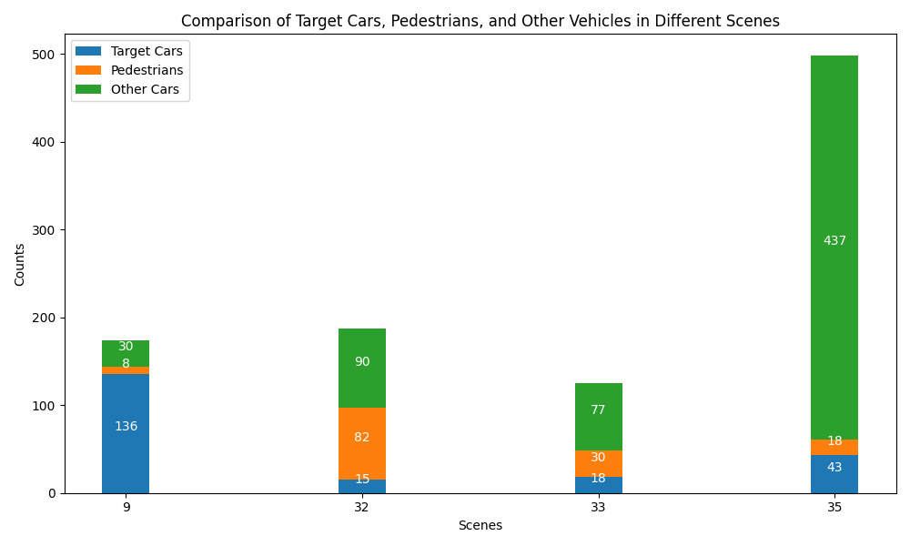
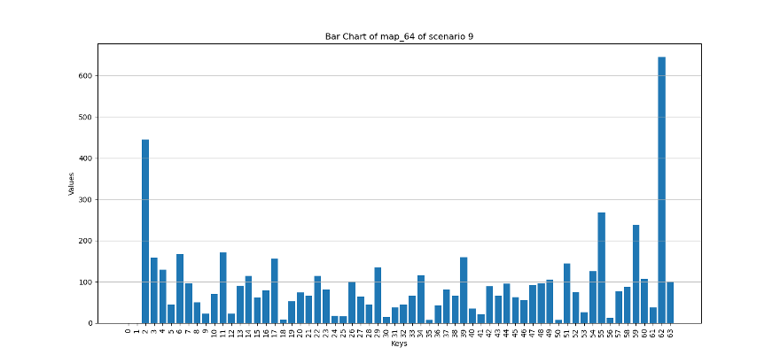
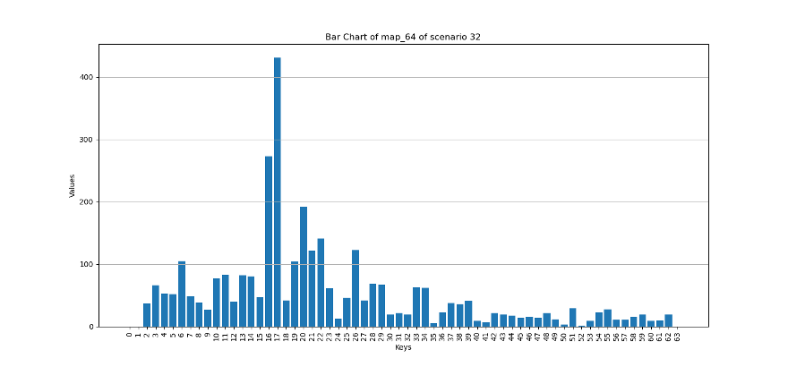
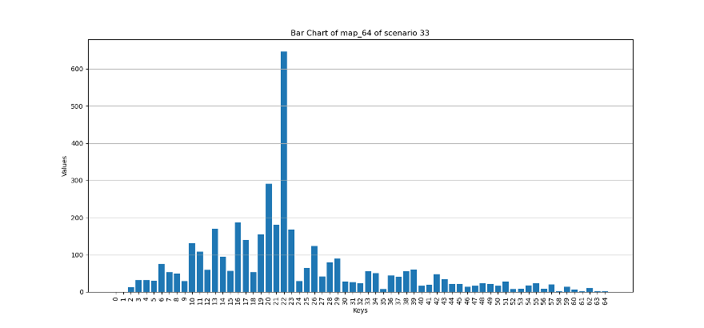
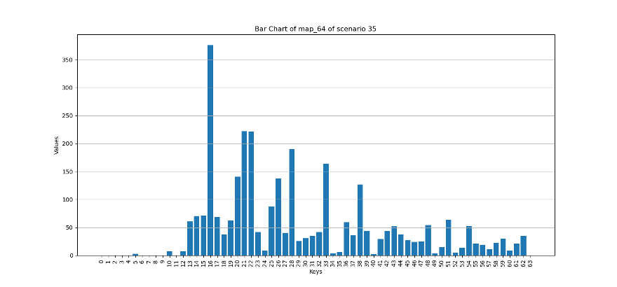
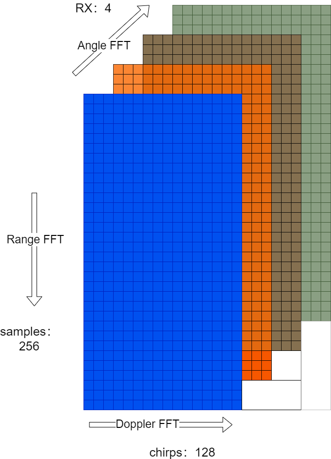
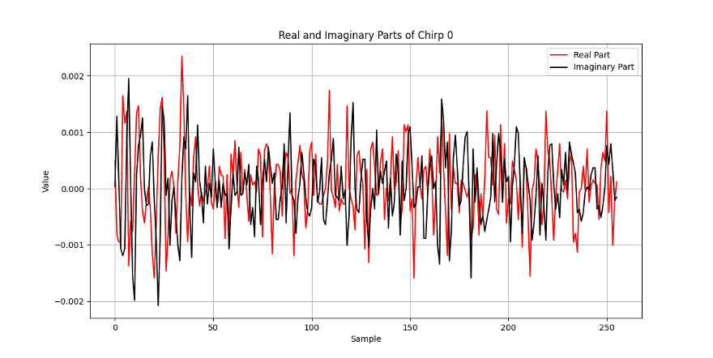
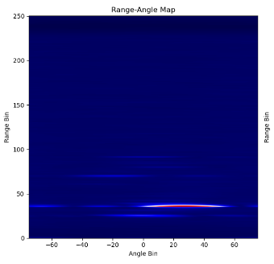
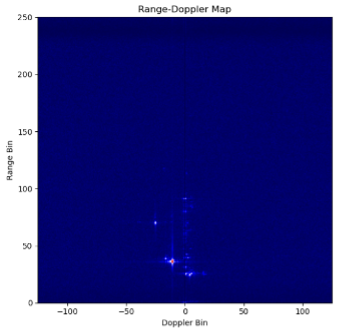
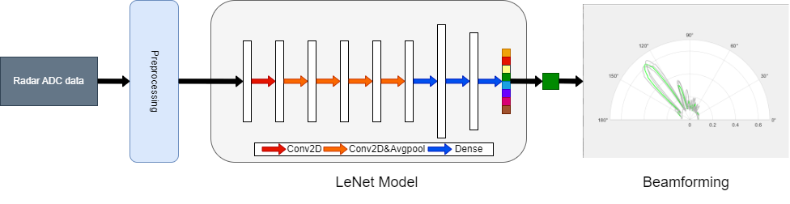

# 基于深度学习的雷达辅助通信波束预测算法研究

 

- [基于深度学习的雷达辅助通信波束预测算法研究](#基于深度学习的雷达辅助通信波束预测算法研究)
  - [1 背景](#1-背景)
  - [2 依赖](#2-依赖)
    - [2.1 硬件](#21-硬件)
    - [2.1 软件](#21-软件)
  - [3 使用](#3-使用)
  - [4 数据集](#4-数据集)
    - [4.1 场景信息](#41-场景信息)
    - [4.2 雷达帧](#42-雷达帧)
    - [4.3 预处理](#43-预处理)
  - [5 模型](#5-模型)
  - [6 结果](#6-结果)
    - [6.1 预处理](#61-预处理)
    - [6.2 网络模型](#62-网络模型)
  - [7 项目结构](#7-项目结构)
  - [8 致谢](#8-致谢)
  - [9 联系我](#9-联系我)
  - [References](#references)

## 1 背景

本项目是我在同济大学软件学院2024年的本科毕业设计。

希望在

## 2 依赖

### 2.1 硬件
为了备份及性能考虑，该项目在以下两种设备上都运行过：
- device1

  个人PC

    

  Memory: 32GB

- device2
  
  
  使用了[腾讯高性能应用服务](https://console.cloud.tencent.com/hai/instance?rid=1)的 GPU基础型，收费是¥1.8每小时
   _Platinum_8255C-0071C5?style=for-the-badge&logo=intel&logoColor=white) 
  
  Memory: 32GB
  
  

### 2.1 软件
对于device1，项目在**windows10**和**wsl2的ubuntu24.04**上都运行成功

在不同的设备上，一些库的版本是通用的：

~~~
tqdm==4.66.2
cupy-cuda12x==13.1.0
numpy==1.26.3
pandas==2.2.2
scikit-learn==1.5.0
scipy==1.13.1
~~~

对于不同的设备，机器学习相关的软件版本略有不同：

|        | Device1(4060 8GB) | Device2(Tesla T4 16GB) |
| ------ | ----------------- | ---------------------- |
| Cuda   | 12.5              | 12.0                   |
| Torch  | 2.3.1+cu121       | 2.0.0+cu117            |
| Python | 3.10.14           | 3.10.11                |

对于机器学习库，只要确认cuda安装正确，可以直接去[Torch网站](https://pytorch.org/get-started/locally/)下载较新版本的torch，不用考虑严格对应版本。

## 3 使用

确保机器至少有**16GB内存+8GB显存**

硬盘部分，对于所有四个数据集，请确保电脑有**80GB存储空间**(解压后)

对于baseline和train，有几个比较重要的参数需要解释

| 参数                    | 解释                                                         | 可选值                |
| ----------------------- | ------------------------------------------------------------ | --------------------- |
| scenario_id             | 选择场景                                                     | 9，32，33，35         |
| pp_type                 | 预处理方式(Range-Angle, Range-Doppler, Radar-cube)           | 对应0，1，2           |
| fft_size                | 快速傅立叶变换结果的维度(运算能力较弱的机器从64开始酌情增加) | 64，128，256，512，…… |
| topk                    | 预测的前k个结果                                              | 1，3，5               |
| early_stopping_patience | 早停发耐心指数                                               | 5                     |

训练的模型保存在saved_models下，

本项目不包含数据集，需要单独下载数据集并在[config.json](./config.json)、[baseline.py](./src/baseline.py)和[train.py](./src/train.py)中修改地址

| 地址             | 解释           | 示例                           |
| ---------------- | -------------- | ------------------------------ |
| project_root_dir | 项目根目录地址 | /absolute/path/to/this/project |
| scenarios: path  | 数据集根目录   | /absolute/path/to/dataset      |

下面是structions：

- git clone本项目到本地

- 使用conda或venv之类的工具安装上一节的软件依赖

- 下载数据集，确认存放位置

- 修改项目中baseline.py、train.py和config.json对应的地址

- 确认预处理方式、fft_size和场景id

- 分别运行baseline.py和train.py

## 4 数据集

所使用的数据集是[DeepSense6G](https://www.deepsense6g.net/)，一个用于 6G 深度学习研究的大规模真实世界多模态传感与通信数据集。

主要使用的是数据集场景中的**雷达测量数据**和**毫米波通信波束功率**。

### 4.1 场景信息

所涉及场景的雷达帧信息

| 场景 | 尺寸             | 时间 | 内容             | 试验平台 | 啁啾斜率      | 啁啾持续时间 |
| ---- | ---------------- | ---- | ---------------- | -------- | ------------- | ------------ |
| 9    | [5964,4,256,128] | 白天 | 毫米波通信，雷达 | 1        | 15.015 MHz/us | 60us         |
| 32   | [3235,4,256,250] | 白天 | 毫米波通信，雷达 | 5        | 8.014 MHz/us  | 47.5us       |
| 33   | [3981,4,256,250] | 晚上 | 毫米波通信，雷达 | 5        | 8.014 MHz/us  | 47.5us       |
| 35   | [3045,4,512,250] | 白天 | 毫米波通信，雷达 | 5        | 15.015 MHz/us | 60us         |

场景周围的环境和各种传感器采集的数据可以参考下面的视频：

<table> <tr> <td> <iframe width="100%" height="300" src="https://www.youtube.com/embed/6NgbENpKWG4" frameborder="0" allow="accelerometer; autoplay; encrypted-media; gyroscope; picture-in-picture" allowfullscreen></iframe> </td> <td> <iframe width="100%" height="300" src="https://www.youtube.com/embed/kwZ6JdFqjEc" frameborder="0" allow="accelerometer; autoplay; encrypted-media; gyroscope; picture-in-picture" allowfullscreen></iframe> </td> </tr> <tr> <td> <iframe width="100%" height="300" src="https://www.youtube.com/embed/o2BBh5HmWXQ" frameborder="0" allow="accelerometer; autoplay; encrypted-media; gyroscope; picture-in-picture" allowfullscreen></iframe> </td> <td> <iframe width="100%" height="300" src="https://www.youtube.com/embed/na4elnHjYJA" frameborder="0" allow="accelerometer; autoplay; encrypted-media; gyroscope; picture-in-picture" allowfullscreen></iframe> </td> </tr> </table>

不同场景中，目标车辆和干扰项数量和组成有较大差异，可以将数据集中的图片按拍摄时的帧率生成视频，借助yoloV8统计出现过的交通参与者，可以更近一步了解场景，对于模型的性能也会有更深的理解

下图是四个场景的不同

需要注意的是，以上的统计并不详尽，即使采用最复杂的模型，对于远处的交通参与者，yolov8仍然无法检测到，但是这同样也超出了雷达的量程，能被yolo检测到的物体，大致都出现在了雷达图中，

就最佳波束而言，目标车辆不同的运动轨迹和场景不同的环境，会直接影响最佳波束的分布，可以看到scenario9因为场景简单、运动线性，波束分布较为均匀，而scenario32和scenario33属于不同时段，但最佳波束分布仍大致相同，说明与目标运动和场景环境有紧密的关系；scenario35的最佳波束分布与前面两个地点有较大的差距。

<table> <tr> <td></td> <td></td> </tr> <tr> <td></td> <td></td> </tr> </table>

雷达工作频率在不同场景有所不同，

### 4.2 雷达帧

以场景9为例，雷达每次测量会获得一个尺寸为[4, 256, 128]的雷达帧，包含**4**个天线在**128**个chirps(啁啾信号，线性调频信号)上的**256**个**复数**采样点信息，每个格子代表一个复数采样点

对于每个采样点所得的数据，有实部和虚部，单个chirp的数据如下所示：

### 4.3 预处理

有三种预处理方式

- 距离-角度(Range-Angle)
- 距离-速度(多普勒)(Range-Doppler)
- 雷达立方体(Radar-Cube, Range-Doppler-Angle)

对于同样的测量值，不同的预处理方式的结果是不同的

<figure class="half">
    
    
</figure>

## 5 模型

项目以baseline、LeNet在Scenario9 下的性能作为基准，测试了包括GoogleNet、AlexNet、ResNet在内的模型，

LeNet结构

## 6 结果

结果有多个层次：

### 6.1 预处理

就窗函数而言，其对于网络的性能改进并不稳定，在有些场景甚至出现倒退的情况

就提高分辨率而言，并非分辨率越高越好，网络性能在分辨率达到一定数值时开始倒退。

### 6.2 网络模型

经过多个数据集上不同预处理方式的实验结果，复杂的网络表现出更强的性能和场景适应能力。

ResNet 在复杂场景下的性能远远超过了原文的 LeNet

## 7 项目结构

目录解释如下

| 根目录       | 子目录 | 解释                     |
| ------------ | ------ | ------------------------ |
| dataset      |        | 可以用来存放数据集       |
| docs         |        | 相关文档                 |
| images       |        | 一些论文用到的图片       |
| saved_models |        | 训练保存的模型           |
| src          |        | 源代码                   |
| src          | data   | 数据集加载、预处理       |
| src          | models | 模型                     |
| src          | plots  | 画图                     |
| src          | Utils  | json解析，训练代码的函数 |

## 8 致谢

感谢我的导师在毕业设计过程中给予我的帮助和指引。

## 9 联系我

EMail：LBJ2053285@tongji.edu.cn

## References

1. https://www.deepsense6g.net/radar-aided-beam-prediction/
2. https://www.deepsense6g.net/scenarios/
3. https://www.wi-lab.net/research/radar-aided-beam-prediction-paper/
